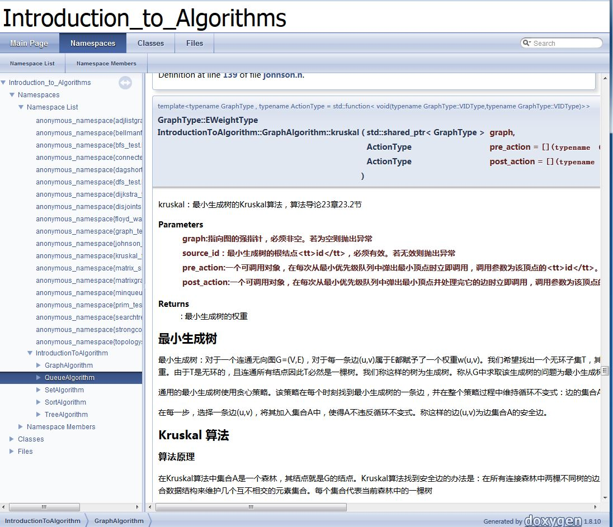

# 《算法导论》中算法的C++实现
<!--
    作者：华校专
    email: huaxz1986@163.com
**  本文档可用于个人学习目的，不得用于商业目的  **
-->
本项目中的所有算法均来自于《算法导论》第三版

## 缘由
在学习算法导论的过程中，本人经过几次阅读做了两轮笔记之后发现，要想掌握算法的思想必须动手实践。
> 笔记扫描版地址：http://pan.baidu.com/s/1mis5sOK以及http://pan.baidu.com/s/1mhKFxQ4

> 所有笔记扫描版下载地址：http://pan.baidu.com/s/1boSzlx1

* 《算法导论》中的算法全部是用伪代码写的，因此大量的语言细节被忽略。比如边界条件的处理
* 在算法转换为代码过程中会对算法有着更深刻的理解

因此在去年底我在电脑上对算法导论的算法用C++实现了一遍。为了更好地促进学习，现在我将这些代码进行了整理（主要是增加了`Doxygen`注释，以及利用`googletest`增加了测试代码）

## 结构

* 文件结构

```
src\
	dynamic_programming_algorithms\: 动态规划算法
			       lcs： 最长公共子序列算法
	google_test\           : gooletest框架的两个文件：gtest.h以及gtest_all.c
	sort_algorithms\       :所有排序算法
			bucket_sort: 桶排序
			count_sort:计数排序
			heap_sort：堆排序
			insert_sort：插入排序
			merge_sort:归并排序
			quick_sort：快速排序
			radix_sort：基数排序
	select_algorithms\     :顺序统计量选择算法
			randomized_select：随机选择的顺序统计量算法
			good_select：最坏情况为O(n)的顺序统计量算法
	tree_algorithms\       :树算法
			binarytree:二叉树
			binarytreenode：二叉树结点
			searchtree:二叉搜索树	
	queue_algorithms\	：队列算法
			min_queue: 最小优先级队列
	set_algorithms\		：集合算法
			disjoint_set： 不相交集合森林
	graph_algorithms\    ：图算法
			basic_graph\ :基本图算法
					graph_representation\ ：图的表示
								graph_vertex：图的顶点
								graph_edge:图的边
								adjlist_graph：图的邻接表的表示法
								matrix_graph：图的矩阵表示法
								graph: 图
					graph_bfs:图的广度优先搜索算法
					graph_dfs：图的深度优先搜索算法
					topology_sort：有向无环图的拓扑排序算法
					strong_connected_component:有向图的强连通分量算法
					connected_component:无向图的连通分量算法
			minimum_spanning_tree\ ：无向图最小生成树算法
					kruskal ： 最小生成树的 kruskal 算法
					prim : 最小生成树的 prim 算法
			single_source_shortest_path\: 有向图单源最短路径算法
					bellman_ford :单源最短路径的 bellman_ford算法
					dag_shortest_path:单源最短路径的dag_shortest_path算法
					dijkstra：单源最短路径的dijkstra算法
			all_node_pair_shortest_path\ :有向图所有结点对之间的最短路径算法
					matrix_shortest_path：结点对之间最短路径的矩阵算法和复平方算法
					floyd_warshall：所有结点对之间最短路径的floyd_warshall算法
					johnson:所有结点对之间最短路径的johnson算法
			max_flow\ : 流网络的最大流算法
					ford_fulkerson： 流网络的ford_fulkerson最大流算法
					generic_push_relabel：流网络的“推送-重贴标签”最大流算法
					relabel_to_front：流网络的“前置-重贴标签”最大流算法
			string_matching_algorithms\ :字符串匹配算法
					regular_match :朴素的字符串匹配算法
					rabin_karp_match: rabin_karp字符串匹配算法
					finite_automaton_match:有限自动机字符串匹配算法
					kmp_match:kmp字符串匹配算法
doc\      ：由doxygen自动生成的文档
Doxyfile  :doxygen配置文件
Introduction_to_Algorithms.pro :Qt项目配置文件
```

* 本项目是利用Qt开发，因此未给出Makefile文件。但是所有的源代码都仅仅使用C++标准库，因此可以跨平台移植。
  使用时只需要包含相应的头文件即可
* 本项目所有算法都是用 `C++ Template`实现，因此算法的实现都在`.h`文件中
* 本项目所有算法都有测试代码。如快速排序在`quicksort.h`中，快速排序的测试代码在`quicksort_test.h`中，二者位于同一目录下
* 本项目所有的命名空间、函数、类以及必要的成员都打上了`doxygen`注释，可以方便的进行文档化。
如下图所示：


目前`\doc`文件夹中已经有转换过来的`html`文件，你也可以自己利用doxygen来执行文档转换工作。文档化之后的帮助文档在浏览器中打开如图所示：



 **本文档仅用于个人学习目的，未经许可不得用于商业目的，转载请注明出处**

 **email: huaxz1986@163.com** 
